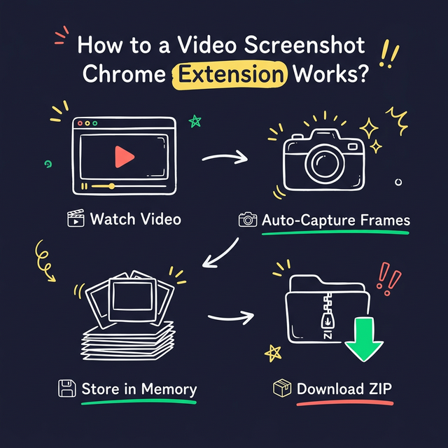

<div align="center">
  <h1>🎬 Video FrameGrab</h1>
  <p><strong>Automatically capture clean screenshots from any HTML5 video. Downloads all frames as a single ZIP.</strong></p>
  
  <p>
    <a href="https://github.com/RLASAF12/Video-FrameGrab/releases"></a>
    
    <a href="LICENSE"></a>
  </p>

  <p><i>A portable, zero-dependency Chrome extension. No per-file download dialog fatigue.</i></p>
</div>

---

## 📸 See It In Action
<div align="center">
  
</div>

## ✨ Features
- **🌐 Any Site**: YouTube, Vimeo, Twitch, and generic HTML5 `<video>` tags.
- **⚡ In-Memory Compilation**: Frames are processed rapidly in-memory and merged into **one single ZIP**. No more "Save As..." dialog spam for every frame.
- **⏱️ Time Range Capture**: Set specific `MM:SS` start and end boundaries.
- **🗂️ Auto Contact Sheet**: Generating an image grid inside the ZIP as `_ContactSheet.png`.
- **🏷️ Filename Template**: Name your outputs exactly how you want (`{title}_{time}_{index}`).
- **🔴 Progress UI**: Live capture counter on the extension badge, popup, and non-intrusively on the video page.
- **📜 Session History**: Keep track of your past capturing sessions directly from the popup browser.

## 🚀 Quick Start

1. Download the latest `video-framegrab.zip` from the [Releases](../../releases) tab and extract it, or clone this repository.
2. Open Google Chrome and navigate to `chrome://extensions/`.
3. Enable **Developer mode** using the toggle in the top right corner.
4. Click the **Load unpacked** button.
5. Select the folder containing the extension files.
6. The extension is now installed! You can pin the `🎬 Video FrameGrab` icon for easy access.

## 🛠️ How It Works

<div align="center">
  
</div>

## ⚙️ Configuration
Open the **Advanced Settings** accordion inside the extension to adjust:

| Setting | Default | Description |
|---|---|---|
| **Capture Interval** | `6 seconds` | How often to grab a frame. |
| **Auto-Capture** | `Off` | Starts capturing automatically when a video begins playing. |
| **Time Range** | `-` | Specify `Start` (00:00) and `End` timestamps to limit the range. |
| **Filename Template**| `{title}_{time}_{index}` | Supported tokens: `{title}, {time}, {index}, {date}` |
| **Contact Sheet** | `Checked` | Creates an image grid thumbnail overview in the final zip. |

## 🕹️ Usage
1. Open a video on a supported platform (e.g., YouTube).
2. Click the `FrameGrab` extension icon.
3. Click **Start Capture**. You will see the counter increase on the popup and a toast overlay directly on the page.
4. Let the video play. (It intelligently ignores ads and pauses!)
5. When finished, click **Stop & Download ZIP**. A single compressed folder containing all frames (and optionally the Contact Sheet) will immediately download.

## 📂 File Structure

```text
├── manifest.json       # Manifest V3 Configuration
├── background.js       # Service worker for downloading files
├── content.js          # Main capture, template, and UI logic
├── minizip.js          # Lightweight pure-JS Dependency-Free Zip Library
├── popup.html          # Pop-up Interface
├── popup.css           # Styling
├── popup.js            # Tabs, Inputs, and Storage handling
├── toast.css           # Progress toast styling
├── .gitignore          
├── CHANGELOG.md        # Release history
├── CONTRIBUTING.md     # Dev rules
└── LICENSE             
```

## ❓ FAQ
**Why do I need to approve `<all_urls>` permission?**
To function on any webpage hosting an HTML5 `<video>` element (Vimeo, Dailymotion, internal sites), it requires generic host permissions. The extension runs locallly and securely in your browser.

**Can it capture DRM-protected videos?**
No. Content protected by Widevine (Netflix, Hulu, Amazon) inherently blocks the HTML Canvas from accessing raw pixel data. 

**Does it use a lot of memory?**
Because it stores frames in-memory before zipping, it depends on the resolution and capture length. A 1080p frame is roughly ~2-4MB raw. Be mindful on highly constrained memory systems if capturing thousands of frames in one sitting.

## 🤝 Contributing
Please see `CONTRIBUTING.md` for guidelines on how to help out! PRs are welcome!

## 📄 License
This project is licensed under the MIT License - see the [LICENSE](LICENSE) file for details.
